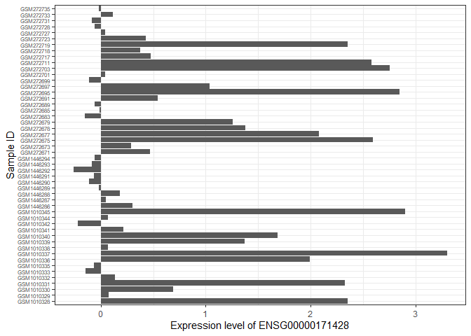

<!-- README.md is generated from README.Rmd. Please edit that file -->

# RPracticePackage

<!-- badges: start -->

[](https://github.com/heidisteadman/RPracticePackage/issues)
[](https://github.com/heidisteadman/RPracticePackage/pulls)
<!-- badges: end -->

The goal of `RPracticePackage` is to help the developers gain practice
creating Bioconductor packages with experimental data.

## Installation instructions

Get the latest stable `R` release from
[CRAN](http://cran.r-project.org/). Then install `RPracticePackage` from
[Bioconductor](http://bioconductor.org/) using the following code:

``` r
if (!requireNamespace("BiocManager", quietly = TRUE)) {
    install.packages("BiocManager")
}

BiocManager::install("RPracticePackage")
```

This code installs BiocManager if it is not already installed. Running
the if statement is required to install the package as it is dependent
on BiocManager to load.

Download the development version from
[GitHub](https://github.com/heidisteadman/RPracticePackage) with:

``` r
BiocManager::install("heidisteadman/RPracticePackage")
```

## Data Info

The data used in this package was accessed through Open Science
Framework (OSF). This database allowed us to use data that was already
neat and ready to be analyzed. However, the original data came from Gene
Expression Omnibus (GEO). The name of every SummarizedExperiment object
is the data set name in GEO. Learn more about the data at the following
links:

- GSE41197:
  <https://www.ncbi.nlm.nih.gov/geo/query/acc.cgi?acc=GSE41197>
- GSE10797:
  <https://www.ncbi.nlm.nih.gov/geo/query/acc.cgi?acc=GSE10797>
- GSE59772:
  <https://www.ncbi.nlm.nih.gov/geo/query/acc.cgi?acc=GSE59772>

The package itself includes a metadata as required by Bioconductor. This
file is a table that lists the name of each object and more information
about where it came from and how it was accessed. See
inst/extdata/metadata.csv. When the package is available in
ExperimentHub, using the query() function will show available objects.

``` r
#library(ExperimentHub)
#eh = ExperimentHub()
#query(eh, RPracticePackage)

# this code throws errors because the package is not currently available in ExperimentHub
```

## Examples

The following is the code required to access the objects within the
package, as well as additional packages we used to analyze the data. The
SummarizedExperiment package is required for both building the package
and accessing the data.

``` r
library(RPracticePackage)
library(SummarizedExperiment)
library(tidyverse)
```

The SummarizedExperiment object for each data set includes 3 matrices.
The first, which we load as expression_data, is a matrix with the
samples as columns and genes as rows. The Ensembl gene ID is used as the
row names. The data in the actual matrix is the expression level of the
gene for the sample. <br> <br> The second matrix we load as
sample_metadata. This is information about the samples themselves, such
as demographics for the patient the sample came from. The samples are
rows and the information is in the columns. <br> <br> The third matrix
we load as feature_data. This is the information about the genes that
were tested for each sample. This includes information like the
chromosome the gene is located on, the Entrez gene ID, and the gene
name. The genes are the rows and the information about the samples is in
the columns.

``` r
data('GSE41197')
expression_data = assay(GSE41197)
sample_metadata = colData(GSE41197)
feature_data = rowData(GSE41197)
```

This is a simple example of using a built-in function to get a general
idea of the data. The summary() function includes data points for each
sample, like the minimum or maximum expression levels across all the
genes. Generally, this isn’t particularly relevant, but does give an
idea of how many samples are in the matrix.

``` r
data('GSE41197')
gene_expression_values = assay(GSE41197)
summary(gene_expression_values)
#>    GSM1010328         GSM1010329         GSM1010330        GSM1010331      
#>  Min.   :-0.58807   Min.   :-0.67193   Min.   :-0.6275   Min.   :-0.67947  
#>  1st Qu.:-0.02803   1st Qu.:-0.02844   1st Qu.:-0.0254   1st Qu.:-0.02467  
#>  Median : 0.17679   Median : 0.17441   Median : 0.1930   Median : 0.20735  
#>  Mean   : 0.35001   Mean   : 0.31648   Mean   : 0.3605   Mean   : 0.38279  
#>  3rd Qu.: 0.51888   3rd Qu.: 0.49118   3rd Qu.: 0.5426   3rd Qu.: 0.58618  
#>  Max.   : 5.89482   Max.   : 5.60029   Max.   : 5.6386   Max.   : 5.22921  
#>    GSM1010332         GSM1010333         GSM1010335         GSM1010336      
#>  Min.   :-0.65721   Min.   :-0.68931   Min.   :-0.80612   Min.   :-0.76911  
#>  1st Qu.:-0.02692   1st Qu.:-0.02032   1st Qu.:-0.01329   1st Qu.:-0.01469  
#>  Median : 0.19357   Median : 0.19358   Median : 0.18998   Median : 0.19854  
#>  Mean   : 0.38505   Mean   : 0.35555   Mean   : 0.34024   Mean   : 0.34292  
#>  3rd Qu.: 0.57769   3rd Qu.: 0.53875   3rd Qu.: 0.50096   3rd Qu.: 0.54229  
#>  Max.   : 5.53771   Max.   : 5.48663   Max.   : 5.15454   Max.   : 5.49399  
#>    GSM1010337         GSM1010338         GSM1010339        GSM1010340      
#>  Min.   :-0.62034   Min.   :-0.73287   Min.   :-0.7865   Min.   :-0.68037  
#>  1st Qu.:-0.02902   1st Qu.:-0.01651   1st Qu.:-0.0320   1st Qu.:-0.01358  
#>  Median : 0.16572   Median : 0.19661   Median : 0.1650   Median : 0.23907  
#>  Mean   : 0.34074   Mean   : 0.35117   Mean   : 0.3178   Mean   : 0.42135  
#>  3rd Qu.: 0.49122   3rd Qu.: 0.53256   3rd Qu.: 0.4736   3rd Qu.: 0.65615  
#>  Max.   : 7.47123   Max.   : 5.35866   Max.   : 6.0962   Max.   : 5.20654  
#>    GSM1010341         GSM1010342          GSM1010344          GSM1010345      
#>  Min.   :-0.71538   Min.   :-0.727634   Min.   :-0.745922   Min.   :-0.73491  
#>  1st Qu.:-0.02971   1st Qu.:-0.004102   1st Qu.:-0.009581   1st Qu.:-0.01498  
#>  Median : 0.19966   Median : 0.228113   Median : 0.199796   Median : 0.22331  
#>  Mean   : 0.39275   Mean   : 0.408147   Mean   : 0.361049   Mean   : 0.38596  
#>  3rd Qu.: 0.59964   3rd Qu.: 0.624571   3rd Qu.: 0.527265   3rd Qu.: 0.62029  
#>  Max.   : 4.58676   Max.   : 4.715135   Max.   : 5.045097   Max.   : 4.98164
```

In the following example, we first access the matrix of gene expression
values. To make it easier to analyze, we convert it into a tibble and
select the first 10 rows. We then used ggplot() to create a bar plot
showing the gene expression levels for one sample across 10 genes.

``` r
data('GSE41197')
gene_expression_values = assay(GSE41197)

exp_tib = as_tibble(gene_expression_values, rownames='Ensembl_Gene_ID')[1:10,] %>%
    ggplot(aes(x=Ensembl_Gene_ID, y=GSM1010328)) +
    geom_col() +
    labs(x='Ensembl Gene ID',y='Sample ID GSM1010328') +
    theme_bw() +
    theme(axis.text.x = element_text(angle = 45, hjust = 1))

exp_tib
```


Here, we first accessed the matrices for 3 data sets included in the
RPracticePackage.

``` r
data('GSE10797')
data('GSE41197')
data('GSE59772')

GSE10197 = assay(GSE10797)
GSE41197 = assay(GSE41197)
GSE59772 = assay(GSE59772)
```

Next, we converted each to a tibble and selected one row, representing
one gene that we knew each data set had in common.

``` r
GSE10197_gene = GSE10197 %>%
    as_tibble(rownames='Ensembl_Gene_ID') %>%
    filter(Ensembl_Gene_ID == "ENSG00000171428")
GSE41197_gene = GSE41197 %>%
    as_tibble(rownames='Ensembl_Gene_ID') %>%
    filter(Ensembl_Gene_ID == "ENSG00000171428") 
GSE59772_gene = GSE59772 %>%
    as_tibble(rownames='Ensembl_Gene_ID') %>%
    filter(Ensembl_Gene_ID == "ENSG00000171428")
```

We then joined the 3 tibbles into one tibble with the full_join()
function. Then, we rotated the tibble to make the selected gene be the
column and the samples be the rows. We now have one tibble with one
column (the gene) and many rows (the samples). <br> <br> Finally, we
used ggplot() to visualize the expression levels for the gene across the
three data sets.

``` r
combined_samples = full_join(GSE10197_gene, GSE41197_gene)
#> Joining with `by = join_by(Ensembl_Gene_ID)`
combined_samples = full_join(combined_samples, GSE59772_gene) %>%
    pivot_longer(cols=-Ensembl_Gene_ID,names_to='Sample_ID',values_to='Expression_Level') %>%
    ggplot(aes(x=Sample_ID,y=Expression_Level)) +
    geom_col() +
    #theme_bw() +
    labs(x='Sample ID',y='Expression level of ENSG00000171428') +
    coord_flip() +
    scale_fill_brewer(palette = "Set3") +
    theme_bw() +
    theme(axis.text.y = element_text(size = 6))
#> Joining with `by = join_by(Ensembl_Gene_ID)`
combined_samples
```



## Citation

Below is the citation output from using `citation('RPracticePackage')`
in R. Please run this yourself to check for any updates on how to cite
**RPracticePackage**.

``` r
print(citation('RPracticePackage'), bibtex = TRUE)
#> To cite package 'RPracticePackage' in publications use:
#> 
#>   heidisteadman (2025). _RPracticePackage_.
#>   doi:10.18129/B9.bioc.RPracticePackage
#>   <https://doi.org/10.18129/B9.bioc.RPracticePackage>,
#>   https://github.com/heidisteadman/RPracticePackage/RPracticePackage -
#>   R package version 0.99.0,
#>   <http://www.bioconductor.org/packages/RPracticePackage>.
#> 
#> A BibTeX entry for LaTeX users is
#> 
#>   @Manual{,
#>     title = {RPracticePackage},
#>     author = {{heidisteadman}},
#>     year = {2025},
#>     url = {http://www.bioconductor.org/packages/RPracticePackage},
#>     note = {https://github.com/heidisteadman/RPracticePackage/RPracticePackage - R package version 0.99.0},
#>     doi = {10.18129/B9.bioc.RPracticePackage},
#>   }
#> 
#>   heidisteadman (2025). "RPracticePackage." _bioRxiv_. doi:10.1101/TODO
#>   <https://doi.org/10.1101/TODO>,
#>   <https://www.biorxiv.org/content/10.1101/TODO>.
#> 
#> A BibTeX entry for LaTeX users is
#> 
#>   @Article{,
#>     title = {RPracticePackage},
#>     author = {{heidisteadman}},
#>     year = {2025},
#>     journal = {bioRxiv},
#>     doi = {10.1101/TODO},
#>     url = {https://www.biorxiv.org/content/10.1101/TODO},
#>   }
```

Please note that the `RPracticePackage` was only made possible thanks to
many other R and bioinformatics software authors, which are cited either
in the vignettes and/or the paper(s) describing this package.

## Development tools

- Continuous code testing is possible thanks to [GitHub
  actions](https://www.tidyverse.org/blog/2020/04/usethis-1-6-0/)
  through *[usethis](https://CRAN.R-project.org/package=usethis)*,
  *[remotes](https://CRAN.R-project.org/package=remotes)*, and
  *[rcmdcheck](https://CRAN.R-project.org/package=rcmdcheck)* customized
  to use [Bioconductor’s docker
  containers](https://www.bioconductor.org/help/docker/) and
  *[BiocCheck](https://bioconductor.org/packages/3.20/BiocCheck)*.
- Code coverage assessment is possible thanks to
  [codecov](https://codecov.io/gh) and
  *[covr](https://CRAN.R-project.org/package=covr)*.
- The [documentation
  website](http://heidisteadman.github.io/RPracticePackage) is
  automatically updated thanks to
  *[pkgdown](https://CRAN.R-project.org/package=pkgdown)*.
- The code is styled automatically thanks to
  *[styler](https://CRAN.R-project.org/package=styler)*.
- The documentation is formatted thanks to
  *[devtools](https://CRAN.R-project.org/package=devtools)* and
  *[roxygen2](https://CRAN.R-project.org/package=roxygen2)*.

For more details, check the `dev` directory.

This package was developed using
*[biocthis](https://bioconductor.org/packages/3.20/biocthis)*.

## Code of Conduct

Please note that the RPracticePackage project is released with a
[Contributor Code of
Conduct](http://bioconductor.org/about/code-of-conduct/). By
contributing to this project, you agree to abide by its terms.
